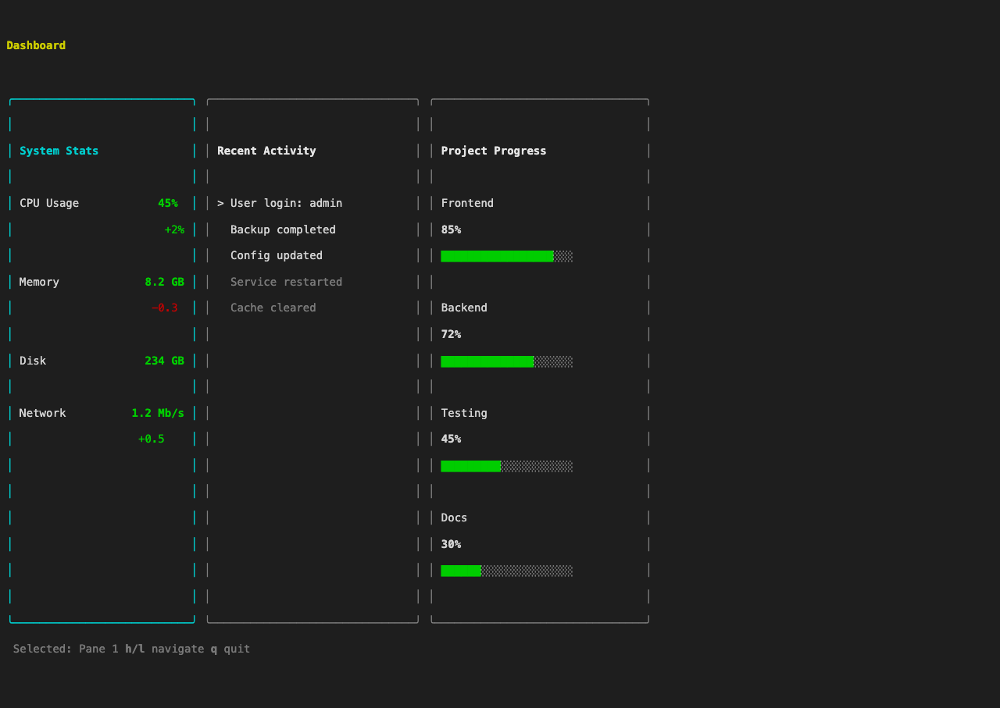
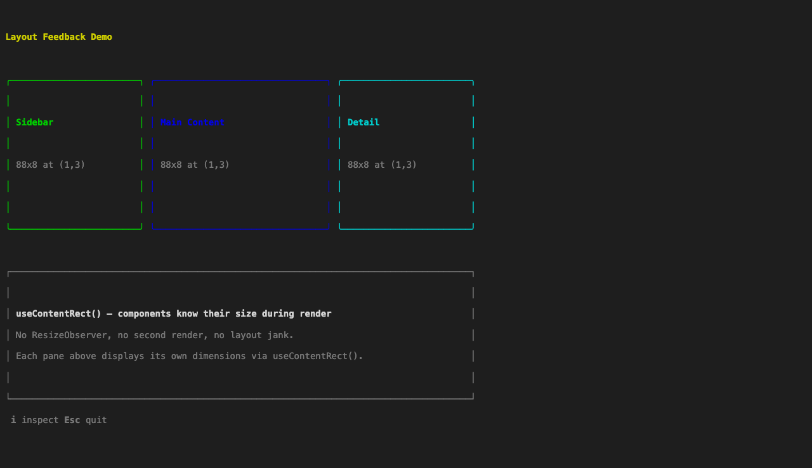
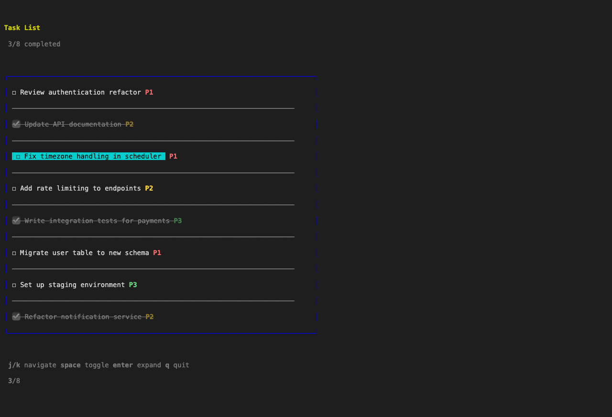
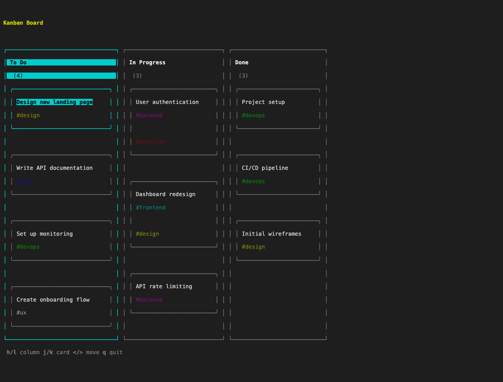

# inkx

React rendering where components know their size.

[](https://www.npmjs.com/package/inkx)
[](https://opensource.org/licenses/MIT)

## The Problem

React components can't know their dimensions during render. This is universal:

- **React DOM** — ResizeObserver dance, second render, layout jank
- **React Native** — FlatList getItemLayout guesses, scroll jank
- **Ink** — manual width-prop threading through entire tree

inkx solves this with a five-phase pipeline: reconcile, measure, layout, content, output. Layout is computed _before_ content rendering. Components access their dimensions synchronously via `useContentRect()`.

```tsx
// Ink: width props cascade through entire tree
<Board width={80}>
  <Column width={26}>
    <Card width={24} />
  </Column>
</Board>

// inkx: just ask
<Board>
  <Column>
    <Card />  {/* useContentRect() inside */}
  </Column>
</Board>
```

Same insight as [WPF's Measure/Arrange pass](https://learn.microsoft.com/en-us/dotnet/desktop/wpf/advanced/layout) (2006) — Microsoft's two-phase layout where parent proposes size, child returns desired size; [CSS Container Queries](https://developer.mozilla.org/en-US/docs/Web/CSS/CSS_containment/Container_queries) (2022) — style elements based on their container's size instead of the viewport; and Facebook's [Litho](https://github.com/facebook/litho)/[ComponentKit](https://github.com/nicklockwood/ComponentKit) — async layout on background threads that yielded 35% scroll performance gains in the Facebook app.



## Quick Start

```tsx
import { run, useInput } from "inkx/runtime"
import { Box, Text, useContentRect } from "inkx"

function App() {
  const { width } = useContentRect()
  const [count, setCount] = useState(0)

  useInput((input, key) => {
    if (input === "j" || key.downArrow) setCount((c) => c + 1)
    if (input === "k" || key.upArrow) setCount((c) => c - 1)
    if (input === "q") return "exit"
  })

  return (
    <Box flexDirection="column">
      <Text>Terminal width: {width}</Text>
      <Text>Count: {count}</Text>
    </Box>
  )
}

await run(<App />)
```

```bash
bun add inkx react @beorn/flexx
```

## Architecture at a Glance

Three runtime layers from low-level to high-level:

| Layer | Entry Point       | Style         | Best For                       |
| ----- | ----------------- | ------------- | ------------------------------ |
| 1     | `createRuntime()` | Elm-inspired  | Pure reducer + event stream    |
| 2     | `run()`           | React hooks   | Most apps (recommended)        |
| 3     | `createApp()`     | Zustand store | Complex apps with many sources |

Each wraps the one below. Layer 1 gives you a pure event loop with AsyncIterable — `reducer(state, event) → state`, `view(state) → JSX`, `schedule()` for async effects. Layer 2 adds React hooks. Layer 3 adds centralized state with a provider pattern.

## Terminal Rendering Modes

inkx supports several rendering strategies for terminal output:

| Mode           | Screen Buffer | Scrollback        | Input | Use Case                       |
| -------------- | ------------- | ----------------- | ----- | ------------------------------ |
| **Fullscreen** | Alternate     | None              | Yes   | TUI apps (takes over terminal) |
| **Inline**     | Normal        | Exists but unused | Yes   | Progress bars, prompts         |
| **Scrollback** | Normal        | Active            | Yes   | CLI tools with history         |
| **Static**     | N/A           | Append-only       | No    | CI, piped output, logging      |

**Fullscreen** uses the alternate screen buffer — content disappears when the app exits. Best for interactive TUI applications.

```tsx
using term = createTerm()
await render(<App />, term, { fullscreen: true })
```

**Inline** renders in the normal screen buffer, updating in place from the current cursor position. Scrollback exists but isn't actively used.

```tsx
using term = createTerm()
await render(<ProgressBar />, term)
```

**Scrollback** — completed items freeze and scroll into terminal scrollback via `useScrollback` + VirtualList's `frozen` prop. The active UI shrinks as items complete. Users scroll up with native terminal features to review history. Similar to pi-tui and Rich's Live.

```tsx
const frozenCount = useScrollback(items, {
  frozen: (item) => item.complete,
  render: (item) => `  ✓ ${item.title}`,
})

<VirtualList items={items} frozen={(item) => item.complete} ... />
```

**Static** renders once to a string — no cursor control needed, safe for piped output and CI environments.

```tsx
const output = renderString(<Summary />, { width: 80 })
console.log(output)

// Strip ANSI codes for piped output
const plain = renderString(<Report />, { width: 80, plain: true })
```

## Render Targets

The RenderAdapter interface separates core logic (reconciler, layout, hooks) from output.

| Target       | Status       | Use Case                            |
| ------------ | ------------ | ----------------------------------- |
| Terminal     | Production   | TUI apps (primary target)           |
| Canvas 2D    | Experimental | Data viz, games, design tools       |
| DOM          | Experimental | Accessibility, text selection       |
| WebGL        | Future       | High-performance Canvas alternative |
| React Native | Future       | Solve FlatList height estimation    |

~60% of inkx code (reconciler, layout, hooks) is target-independent.

## Key Features

### Layout & Rendering

- `useContentRect()` / `useScreenRect()` — sync layout feedback during render
- Five-phase pipeline with dirty tracking — only changed nodes re-render
- Pluggable layout: [Flexx](https://github.com/beorn/flexx) (default, pure JS) or Yoga (WASM)
- 165µs cold render, 169µs dirty update for 1000 nodes ([benchmarks](docs/ink-comparison.md#performance))

### Memory & Stability

- **No WASM linear memory growth** — Flexx is pure TypeScript; Yoga WASM allocates linear memory that grows monotonically during long sessions and cannot be reclaimed without resetting the entire module
- **Layout caching** — Flexx fingerprints nodes and caches layout results; unchanged subtrees skip recomputation entirely. Static UI regions (status bars, headers, chrome) have zero layout cost after first render
- **Zero initialization overhead** — no async WASM loading; instant startup with no deferred imports needed
- **No native dependencies** — pure JS/TS, no platform-specific C++ compilation (Yoga NAPI) or WASM binaries
- **Built-in CJK/wide character support** — wcwidth-aware text measurement prevents misaligned layouts with Chinese, Japanese, Korean, and emoji content
- **Incremental terminal output** — buffer diff emits only changed cells; streaming LLM output or rapid state updates produce minimal terminal I/O instead of full-screen repaints



### Components

- **Box** — flexbox container with borders, padding, overflow, focus, mouse events
- **Text** — styled text with auto-truncation, extended underlines
- **Link** — OSC 8 hyperlinks (clickable URLs in supporting terminals)
- **VirtualList** — efficient rendering for large lists (100+ items)
- **Console** — captures and displays `console.log` output cleanly alongside the UI
- **TextInput** / **ReadlineInput** — text input with readline shortcuts (Ctrl+A/E/W/K/Y)
- **TextArea** — multi-line text input with word wrap, scrolling, and cursor movement
- **InputBoundary** — isolates input scope for embedded interactive components
- `overflow="scroll"` with `scrollTo` — no manual virtualization needed





### Input & Interaction

- Input layer stack — DOM-style event bubbling (LIFO) for modal dialogs and text input
- [Kitty keyboard protocol](https://sw.kovidgoyal.net/kitty/keyboard-protocol/) — Cmd ⌘, Hyper ✦, key release events, international keyboard support
- Mouse support (SGR protocol) — click, double-click, scroll, drag with DOM-style event props
- Focus system — tree-based focus management with scopes, spatial navigation, click-to-focus
- Plugin composition: withCommands, withKeybindings, withDiagnostics
- Hotkey parsing with macOS symbols: `parseHotkey("⌘K")`, `matchHotkey(key, "⌃⇧A")`

### Terminal Features

- Synchronized updates (DEC 2026) — atomic screen painting, no flicker in tmux/Zellij
- Scrollback mode — completed items freeze into terminal scrollback via `useScrollback`; active UI shrinks as items complete
- Adaptive rendering — `term.hasCursor()`, `term.hasColor()`, `term.hasInput()` for graceful degradation
- `renderString()` — static rendering for non-TTY output (CI, piped, headless)
- Kitty graphics protocol — inline image display ([example](examples/kitty/images.tsx))
- `using` / Disposable cleanup — automatic resource teardown

### Testing

- `createRenderer` with configurable dimensions
- Playwright-style locators: `getByTestId`, `getByText`, `locator()`
- `withDiagnostics`: incremental vs fresh render verification (catches rendering regressions in CI)

### Unicode & Streams

- 28+ unicode utilities (grapheme splitting, display width, CJK, emoji)
- AsyncIterable helpers: merge, map, filter, throttle, debounce, batch

## Ink Compatibility

Drop-in replacement for [Ink](https://github.com/vadimdemedes/ink). Same components, same hooks API. See [migration guide](docs/migration.md) and [detailed comparison](docs/ink-comparison.md) for feature/performance differences.

## Status

**Experimental** — actively developed, used in production apps, but APIs may change and things may break. The terminal render target is stable; non-TUI render targets (Canvas, DOM) are prototypes only.

| Feature                                           | Status     |
| ------------------------------------------------- | ---------- |
| Core components (Box, Text)                       | Stable     |
| Hooks (useContentRect, useInput, useApp, useTerm) | Stable     |
| React reconciler (React 19)                       | Stable     |
| Flexx layout engine (default)                     | Stable     |
| Yoga layout engine (WASM, optional)               | Stable     |
| Terminal target                                   | Production |
| Canvas / DOM targets                              | Prototype  |

## Examples

```bash
bun run examples/dashboard/index.tsx      # Multi-pane dashboard
bun run examples/kanban/index.tsx         # 3-column kanban board
bun run examples/task-list/index.tsx      # Scrollable task list
bun run examples/search-filter/index.tsx  # useTransition + useDeferredValue
bun run examples/async-data/index.tsx     # Suspense + async loading
bun run examples/textarea/index.tsx       # Multi-line text input
bun run examples/scrollback/index.tsx    # Scrollback mode (frozen items)
```

See [examples/index.md](examples/index.md) for descriptions.

## Documentation

| Document                                   | Description                                              |
| ------------------------------------------ | -------------------------------------------------------- |
| [Getting Started](docs/getting-started.md) | Runtime layers and tutorial                              |
| [Components](docs/components.md)           | Box, Text, VirtualList, Console, inputs                  |
| [Hooks](docs/hooks.md)                     | useContentRect, useScreenRect, useInput, useApp, useTerm |
| [Architecture](docs/architecture.md)       | Pipeline, RenderAdapter interface                        |
| [Testing](docs/testing.md)                 | Strategy, locators, withDiagnostics                      |
| [Internals](docs/internals.md)             | Reconciler deep dive                                     |
| [Performance](docs/performance.md)         | Benchmarks and optimization                              |
| [Streams](docs/streams.md)                 | AsyncIterable helpers                                    |
| [Focus Routing](docs/focus-routing.md)     | Input routing pattern                                    |
| [Plugins](docs/plugins.md)                 | withCommands, withKeybindings, withDiagnostics           |
| [Ink Comparison](docs/ink-comparison.md)   | Detailed comparison                                      |
| [Migration](docs/migration.md)             | Ink → inkx guide                                         |
| [Troubleshooting](docs/troubleshooting.md) | Common issues and debugging                              |
| [Roadmap](docs/roadmap.md)                 | Render targets and future plans                          |

## Related Projects

| Project                                    | Role                                            |
| ------------------------------------------ | ----------------------------------------------- |
| [Ink](https://github.com/vadimdemedes/ink) | API compatibility target                        |
| [Flexx](https://github.com/beorn/flexx)    | Default layout engine (2.5x faster, 5x smaller) |
| [chalkx](https://github.com/beorn/chalkx)  | Terminal primitives (re-exported by inkx)       |
| [Yoga](https://yogalayout.dev/)            | Optional layout engine (WASM)                   |

## License

MIT
