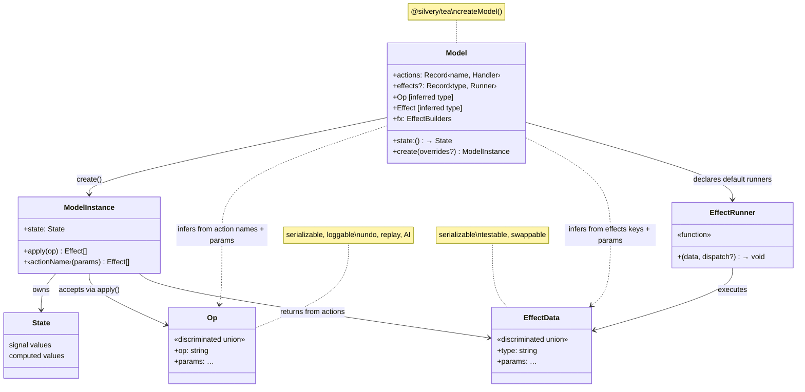
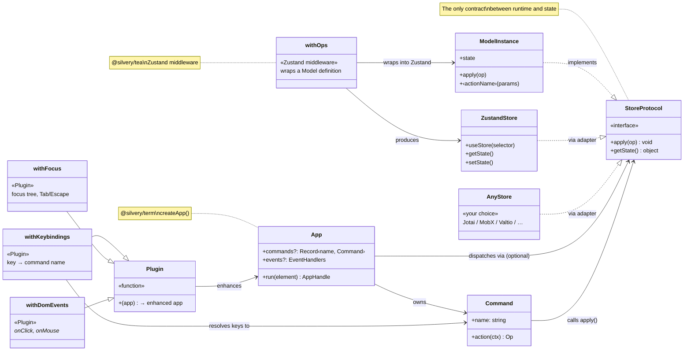
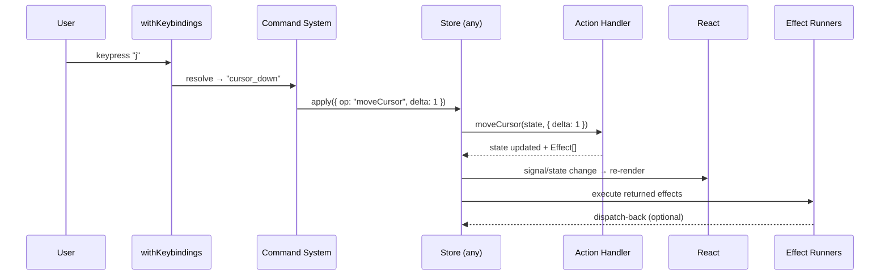
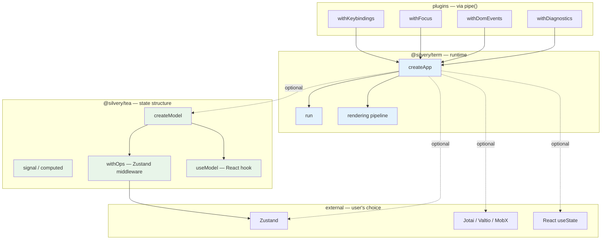

# State API Redesign — Draft

_Status: draft. Bead: km-5kh9r._

## The Problem

The current API has six entry points for state management (`createApp`, `createSlice`, `createEffects`, `createStore`, `tea()`, `run()`), each with a different shape and mental model. Users don't know which ones combine, in what order, or which to pick.

Deeper issue: **state management is coupled to the runtime.** `createApp` bundles Zustand internals, event handling, and terminal lifecycle into one call. Users who want a different state management approach (Zustand directly, Jotai, MobX, plain useState) have no clean path.

## Design Principles

1. **Rendering and state are separate concerns.** Silvery is a rendering framework. State management is optional and pluggable.
2. **`@silvery/tea` is a standalone state management library.** It works with Silvery, React DOM, React Native, or no framework at all.
3. **`createApp` is the runtime host.** It handles events, commands, plugins, terminal lifecycle. It's state-agnostic — bring your own store, or use `@silvery/tea`, or just `useState`.
4. **One sip at a time.** The progression adds concepts incrementally. You never switch APIs — you grow the same one.

## Package Boundaries

```
@silvery/tea     — state management library (standalone, framework-agnostic)
                   createModel, signal, computed, apply, effects
                   Works with any React framework or even vanilla JS

@silvery/term    — terminal runtime (state-agnostic)
                   createApp, run, terminal I/O, rendering pipeline
                   Integrates with @silvery/tea but doesn't require it

@silvery/react   — React reconciler, components, hooks
@silvery/ui      — component library (SelectList, TextInput, ...)
@silvery/theme   — theming (palettes, tokens, auto-detection)
```

**The litmus test:** Someone building a React DOM app should be able to `npm install @silvery/tea` and use `createModel` + signals without touching terminal rendering.

## `@silvery/tea` — The State Library

### Model

A model bundles three things: reactive state, named actions (ops-as-data), and effect definitions.

```typescript
import { createModel, signal, computed } from "@silvery/tea"

const Todo = createModel({
  // State factory — returns reactive signals
  state: () => {
    const items = signal<Item[]>([])
    return {
      cursor: signal(0),
      items,
      doneCount: computed(() => items.value.filter(i => i.done).length),
    }
  },

  // Actions — named, params inferred for the Op union
  actions: {
    moveCursor(s, { delta }: { delta: number }) {
      s.cursor.value = clamp(s.cursor.value + delta, 0, s.items.value.length - 1)
    },
    toggleDone(s, { index }: { index: number }) {
      s.items.value = s.items.value.map((item, i) =>
        i === index ? { ...item, done: !item.done } : item
      )
      return [
        Todo.fx.persist({ data: s.items.value }),
        Todo.fx.toast({ message: `Toggled ${s.items.value[index].text}` }),
      ]
    },
  },

  // Effects — declares the effect vocabulary + how to run each one
  effects: {
    persist: async ({ data }: { data: unknown }) => {
      await fs.writeFile("data.json", JSON.stringify(data))
    },
    toast: ({ message }: { message: string }) => {
      showToast(message)
    },
  },
})

// Inferred types
type TodoOp = typeof Todo.Op
// { op: "moveCursor"; delta: number } | { op: "toggleDone"; index: number }

type TodoEffect = typeof Todo.Effect
// { type: "persist"; data: unknown } | { type: "toast"; message: string }
```

**Key properties:**

- **Signals** are the reactivity primitive. Components read `.value` and auto-subscribe. `computed()` derives from other signals. But signals are `@silvery/tea`'s choice — the runtime doesn't require them.
- **Actions** are pure functions: `(state, params?) → void | Effect[]`. Handler names + param types infer the `Op` union automatically.
- **Effects** are declared once in the model. Each key becomes a typed builder on `Todo.fx` and a runner. Actions return effect data; the model executes runners after the action completes.
- **Independently testable.** Call actions directly, assert on returned effects. No mocks, no framework.

### Calling actions and effects

A model instance exposes both ergonomic direct calls and serializable data forms:

```typescript
const todo = Todo.create()

// ── Actions ──

// Direct call — ergonomic, day-to-day use
todo.moveCursor({ delta: 1 })
todo.toggleDone({ index: 2 })

// Op-as-data — for undo, replay, AI, logging
todo.apply({ op: "moveCursor", delta: 1 })
todo.apply({ op: "toggleDone", index: 2 })

// Both forms go through the same pipeline:
// action handler → state update → effect runners → undo history / logs

// ── Effects ──

// Typed builder — autocomplete, compile-time checked
Todo.fx.persist({ data: items })   // → { type: "persist", data: items }
Todo.fx.toast({ message: "hi" })   // → { type: "toast", message: "hi" }
Todo.fx.nope({ bad: true })        // compile error — no "nope" effect

// Plain object — same thing, manual construction
{ type: "persist", data: items }

// ── Types ──
typeof Todo.Op      // union of all action ops
typeof Todo.Effect  // union of all effect types
```

The direct call (`todo.toggleDone(...)`) internally creates the op and routes through `apply`, so logging, undo history, and effect execution all fire regardless of which form you use. The op form (`todo.apply(...)`) is the same pipeline, just entered with explicit data.

### How effects run

Actions are pure — they update state and _return_ effect data. They never perform I/O. The model's runtime executes the returned effects after the action completes:

```
todo.toggleDone({ index: 2 })
         │
    ┌────▼──────────────────────┐
    │ 1. Create op              │  { op: "toggleDone", index: 2 }
    └────┬──────────────────────┘
         │
    ┌────▼──────────────────────┐
    │ 2. Run action handler     │  toggleDone(state, { index: 2 })
    │    State updates (sync)   │  s.items.value = ...
    │    Returns effect data    │  → [{ type: "persist", ... }, { type: "toast", ... }]
    └────┬──────────────────────┘
         │
    ┌────▼──────────────────────┐
    │ 3. Record op              │  push to undo history, log, replay buffer
    └────┬──────────────────────┘
         │
    ┌────▼──────────────────────┐
    │ 4. Execute effect runners │  effects.persist({ data }) → fs.writeFile(...)
    │    (async, fire-and-forget │  effects.toast({ message }) → showToast(...)
    │     or dispatch-back)     │
    └───────────────────────────┘
```

**Step 2 is pure.** The action handler sees state, mutates signals, and returns effect descriptions. It never calls `fetch()` or `fs.writeFile()` — those live in step 4.

**Step 4 is impure.** The runners declared in `effects: { ... }` execute the data. They can be async, can fire-and-forget, or can dispatch back into the model (for request/response patterns):

```typescript
effects: {
  // Fire-and-forget
  persist: async ({ data }: { data: unknown }) => {
    await fs.writeFile("data.json", JSON.stringify(data))
  },

  // Dispatch-back — async result re-enters the model as a new op
  fetch: async ({ url, onSuccess }: { url: string; onSuccess: string }, dispatch) => {
    const data = await fetch(url).then((r) => r.json())
    dispatch({ op: onSuccess, data })  // re-enters as a new action
  },
}
```

**Swappable per environment.** The `effects` declaration is the default, but runners can be overridden at instantiation:

```typescript
// Production — real I/O
const todo = Todo.create()

// Tests — collect effects, don't execute
const todo = Todo.create({ effects: "collect" })
const effects = todo.toggleDone({ index: 0 })
expect(effects).toContainEqual(Todo.fx.persist({ data: expect.any(Array) }))

// Replay — skip I/O entirely
const todo = Todo.create({ effects: "skip" })
for (const op of replayLog) todo.apply(op)
```

This is the core value proposition: **actions are pure functions you can test, replay, and compose. Effects are data you can inspect, collect, swap, or skip.** The runners are just the last mile — and they're the only impure part.

### Model without effects

Effects are optional. State + actions alone is the common case:

```typescript
const Counter = createModel({
  state: () => ({ count: signal(0) }),
  actions: {
    increment(s) { s.count.value += 1 },
    decrement(s) { s.count.value -= 1 },
  },
})
```

### Model without signals

For users who prefer plain state, models could accept plain objects with proxy-based mutation tracking (similar to Immer or Valtio):

```typescript
const Counter = createModel({
  state: { count: 0 },  // plain object — auto-proxied
  actions: {
    increment(s) { s.count += 1 },  // mutation intercepted
  },
})
```

This is an open question — see [Open Questions](#open-questions).

### Using a model with React

`@silvery/tea` provides a React hook for subscribing to model state:

```tsx
import { useModel } from "@silvery/tea/react"

function TodoList() {
  const cursor = useModel(todo, (s) => s.cursor.value)
  const items = useModel(todo, (s) => s.items.value)
  return (
    <Box flexDirection="column">
      {items.map((item, i) => (
        <Text key={item.id} inverse={cursor === i}>
          {item.done ? "[x] " : "[ ] "}{item.text}
        </Text>
      ))}
    </Box>
  )
}
```

This hook works with any React renderer — Silvery, React DOM, React Native.

### Multiple models

Models compose by namespace. They never import each other:

```typescript
const board = Board.create()
const dialog = Dialog.create()
const search = Search.create()

// Cross-model communication via dispatch effects
const Dialog = createModel({
  // ...
  actions: {
    confirm(s) {
      s.open.value = false
      return [{ type: "dispatch", target: "board", op: "addItem", text: s.value.value }]
    },
  },
})
```

The `dispatch` effect is data — it describes intent without importing the target model. The host (e.g. `createApp`) wires up the routing.

## `createApp` — The Runtime Host

`createApp` is about **runtime composition**: how input reaches your app and how your app reaches the terminal. It's state-agnostic.

### With `@silvery/tea` model (recommended path)

```typescript
import { createApp } from "@silvery/term/runtime"
import { Todo } from "./todo-model"

const app = createApp({
  model: Todo,

  commands: {
    cursor_down: {
      name: "Move Down",
      action: (ctx) => ({ op: "moveCursor", delta: 1 }),
    },
    toggle_done: {
      name: "Toggle Done",
      action: (ctx) => ({ op: "toggleDone", index: ctx.state.cursor.value }),
    },
  },
})

await app.run(<TodoView />)
```

`createApp` recognizes a `@silvery/tea` model and wires up `apply`, effect routing, and state access automatically. Commands are part of `createApp` because they bridge input to state — they need both.

### With Zustand (user's choice)

```typescript
import { create } from "zustand"

const useStore = create((set) => ({
  count: 0,
  increment: () => set((s) => ({ count: s.count + 1 })),
}))

const app = createApp({
  events: {
    key(input) {
      if (input === "j") useStore.getState().increment()
      if (input === "q") return "exit"
    },
  },
})

await app.run(<Counter />)
```

### With plain useState (simplest)

```tsx
await run(<Counter />)  // no createApp needed
```

### With multiple models

```typescript
const app = createApp({
  models: {
    board: Board,
    dialog: Dialog,
    search: Search,
  },

  commands: {
    cursor_down: {
      name: "Move Down",
      action: (ctx) => ctx.board.apply({ op: "moveCursor", delta: 1 }),
    },
    open_search: {
      name: "Search",
      action: (ctx) => ctx.search.apply({ op: "open" }),
    },
  },
})
```

Components access namespaced state:

```tsx
function BoardView() {
  const cursor = useModel(app.models.board, (s) => s.cursor.value)
  // ...
}
```

## Plugins

Plugins add runtime capabilities. They compose via `pipe()` and are state-agnostic:

```typescript
const app = pipe(
  createApp({ model: Todo, commands }),
  withKeybindings({       // key → command mapping (configurable, user-facing)
    j: "cursor_down",
    k: "cursor_up",
    x: "toggle_done",
  }),
  withFocus(),            // Tab/Shift-Tab navigation, focus scopes
  withDomEvents(),        // onClick, onMouseDown on components
  withDiagnostics(),      // Render validation, instrumentation
)
```

Plugins are `(app) => enhancedApp` — infrastructure, not domain. They don't define state or actions.

**Keybindings are a plugin**, not part of `createApp` or the model. They're a UI concern — the mapping from physical keys to command names. Different users, different terminals, different keybinding schemes. The model defines what actions exist; commands name them; keybindings wire keys to those names. Three separate concerns, three separate places.

## The Sip Progression

The progression is about **adopting more structure**, not adopting Silvery's state library. Each sip works with any state approach — `@silvery/tea` is the recommended one, but never required.

| Sip | What you add | State approach | Runtime |
|-----|-------------|----------------|---------|
| 1 | Nothing | `useState` | `run()` |
| 2 | Shared state | Any store (tea, Zustand, Jotai, ...) | `createApp` |
| 3 | Ops-as-data | `createModel` actions → typed Op union | `createApp` |
| 4 | Commands | Named intents | `createApp` + commands |
| 5 | Keybindings | Key → command mapping | `withKeybindings()` plugin |
| 6 | Effects as data | `createModel` effects → typed Effect union | `createApp` |
| 7 | Composition | Multiple models + dispatch effects | `createApp` + models |

Sips 1-2 are state-agnostic. Sips 3+ are where `@silvery/tea` shines — but even there, you could hand-roll the ops-as-data pattern with any store.

## Domain Model

### Core concepts



### How it integrates



### Runtime pipeline



### Package ownership



The dashed lines are the key insight: **`createApp` has no hard dependency on any state library.** The only contract is `StoreProtocol` — `{ apply(op), getState() }` — and even that's optional (you can use raw event handlers instead).

## Architecture Summary

Three layers, loosely coupled:

| Layer | Package | Concern | Depends on |
|-------|---------|---------|------------|
| **State structure** | `@silvery/tea` | ops-as-data, effects-as-data, signals | Nothing (standalone) |
| **Runtime** | `@silvery/term` | events, commands, rendering, terminal I/O | `@silvery/react` |
| **Plugins** | `pipe()` | keybindings, focus, DOM events, diagnostics | Runtime (App interface) |

`@silvery/tea` enhances any store — as a Zustand middleware, as standalone `Model.create()`, or via the `StoreProtocol` interface. The runtime doesn't know or care which path you took.

## What Changes

| Current | New | Why |
|---------|-----|-----|
| `createSlice(init, handlers)` | `createModel({ state, actions, effects? })` | Better name, bundles effects, standalone |
| `createEffects({ ... })` | `effects` field in `createModel` | One definition, not two |
| `createApp(() => (set, get) => {...})` | `createApp({ model?, events?, commands? })` | State-agnostic, no Zustand exposure |
| keybindings in `createApp` | `withKeybindings()` plugin | UI concern, not state or runtime |
| `tea(state, reducer, { runners })` | Removed — internal bridge no longer needed | `createApp` integrates with models directly |
| `createStore(config)` | Stays — framework-free TEA store | Niche but real use case |
| `run(element)` | Stays — sip 1, no state management | The floor |
| `pipe()` + plugins | Stays — unchanged | Already clean |
| `useApp(selector)` | `useModel(model, selector)` | Works with any React renderer |

## Why `@silvery/tea` Over Zustand (or Jotai, or MobX)

`@silvery/tea` isn't a replacement for Zustand — it's a different level of abstraction. You could use Zustand with Silvery and be perfectly happy. `@silvery/tea` earns its keep when your app needs things Zustand doesn't provide out of the box.

### What Zustand gives you

Zustand is excellent at shared reactive state. You define a store, components subscribe to slices, and re-renders are surgical. If all you need is "multiple components reading and writing the same state," Zustand (or Jotai, or Valtio) is the right tool and you should use it with Silvery directly.

```typescript
// Zustand — great for shared state
const useStore = create((set) => ({
  cursor: 0,
  items: [],
  moveCursor: (delta) => set((s) => ({ cursor: s.cursor + delta })),
  toggleDone: (i) => set((s) => ({
    items: s.items.map((item, j) => j === i ? { ...item, done: !item.done } : item),
  })),
}))
```

### What `@silvery/tea` adds

**1. Ops-as-data.** Every state change is a serializable object. This unlocks undo/redo, time-travel debugging, collaboration (send ops over the wire), AI automation (LLMs emit structured ops), and replay.

```typescript
// Zustand: function call — executes and vanishes
useStore.getState().toggleDone(2)

// @silvery/tea: data — inspectable, serializable, reversible
apply({ op: "toggleDone", index: 2 })
```

**2. Type-inferred op unions.** You write handlers; `createModel` infers the discriminated union. No manual type declaration, no switch/case boilerplate.

```typescript
const Todo = createModel({
  actions: {
    moveCursor(s, { delta }: { delta: number }) { ... },
    toggleDone(s, { index }: { index: number }) { ... },
  },
})

type Op = typeof Todo.Op
// { op: "moveCursor"; delta: number } | { op: "toggleDone"; index: number }
// ↑ inferred automatically from the handler signatures
```

**3. Effects as data.** Side effects are return values, not inline calls. Test state transitions without mocking fetch, fs, or anything else.

```typescript
// Zustand: I/O mixed into handler — need mocks to test
toggleDone: async (i) => {
  set(/* ... */)
  await fetch("/api", { body: JSON.stringify(get().items) })  // untestable
}

// @silvery/tea: I/O described as data — test the pure function
toggleDone(s, { index }) {
  s.items.value = /* ... */
  return [{ type: "persist", data: s.items.value }]  // testable
}

// Test: no mocks
const effects = Todo.toggleDone(state, { index: 0 })
expect(effects).toContainEqual({ type: "persist", data: expect.any(Array) })
```

**4. Composable state machines.** Independent models communicate through dispatch effects — no imports between them. Each model is testable in isolation.

**5. Integrated effect runners.** Runners live alongside the model definition. Swap them per environment — production hits real APIs, tests collect effects, replays skip I/O entirely.

### When to use what

| Need | Use |
|------|-----|
| Shared reactive state | Zustand, Jotai, Valtio — or `@silvery/tea` |
| Undo/redo | `@silvery/tea` (ops are data) |
| Time-travel debugging | `@silvery/tea` (ops are data) |
| AI automation | `@silvery/tea` (ops are structured data LLMs can emit) |
| Testable side effects | `@silvery/tea` (effects as data) |
| Customizable keybindings | `@silvery/tea` + commands (actions have names) |
| Multiple independent state machines | `@silvery/tea` (models compose via dispatch effects) |
| Simple UI state (toggles, forms) | `useState` — no library needed |

The honest answer: most dashboard-style apps are fine with Zustand or even useState. `@silvery/tea` shines in keyboard-driven apps with complex state (editors, IDEs, multi-pane TUIs) where undo, replay, testability, and AI automation matter.

## How `createApp` Stays State-Agnostic

`createApp` integrates with any state library through a minimal protocol. When you pass a `@silvery/tea` model, it wires up automatically. When you bring your own store, you wire it yourself — `createApp` just provides the runtime.

### The integration protocol

For `createApp` to wire commands to state, it needs two things from your store:

```typescript
interface StoreProtocol<Op> {
  apply(op: Op): void        // dispatch an action
  getState(): unknown         // read current state (for command context)
}
```

`@silvery/tea` models implement this natively. For other stores, you provide a thin adapter:

```typescript
// Zustand adapter — 3 lines
const app = createApp({
  store: {
    apply: (op) => zustandStore.getState()[op.op]?.(op),
    getState: () => zustandStore.getState(),
  },
  commands: { ... },
})
```

Or skip the protocol entirely and handle events yourself:

```typescript
// No protocol — just event handlers
const app = createApp({
  events: {
    key(input) {
      if (input === "j") myStore.whatever()
    },
  },
})
```

The protocol is opt-in. It exists so that `commands` and `keybindings` can dispatch to your store — if you don't use commands, you don't need it.

## Open Questions

1. **Auto-signaling.** Should `state: { count: 0 }` auto-wrap in signals (Valtio-style proxy)? Reduces ceremony but hides reactivity. Proposal: support both — plain object = auto-proxied, explicit `signal()` = manual control.

2. **Naming: "model" vs alternatives.** "Model" is Elm's term (good precedent) but overloaded (MVC, ML). Alternatives: `machine`, `domain`, `store`. Leaning: **model**.

3. **React bridge.** `useModel(model, selector)` needs a subscription mechanism. With signals, this could use `useSyncExternalStore` under the hood. Should `@silvery/tea/react` be a separate entry point or bundled?

4. **`createApp` integration contract.** What interface must a state library implement for `createApp` to wire it up? Proposal: `{ apply(op): Effect[], state: object }` — minimal protocol. `@silvery/tea` models implement this natively; other stores could implement it via a thin adapter.

5. **Command context.** Commands need access to state to compute actions. With state-agnostic `createApp`, how does the command context work? Proposal: `createApp({ model })` injects `ctx.state` and `ctx.apply`; `createApp({ events })` injects a generic `ctx` that the user populates.

6. **Migration path.** `createSlice` and current `createApp` have users. Keep old APIs as deprecated wrappers? One release cycle?
