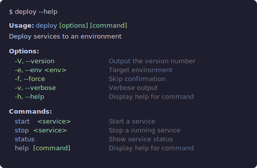

# @silvery/commander

Type-safe [Commander.js](https://github.com/tj/commander.js) with validated options, colorized help, and [Standard Schema](https://github.com/standard-schema/standard-schema) support. Drop-in replacement — `Command` extends Commander's `Command`. Install once, Commander is included.

```bash
npm install @silvery/commander
```

## Example

```typescript
import { Command, z } from "@silvery/commander"

const program = new Command("deploy")
  .description("Deploy services to an environment")
  .version("1.0.0")
  .option("-e, --env <env>", "Target environment", z.enum(["dev", "staging", "prod"]))
  .option("-f, --force", "Skip confirmation")
  .option("-v, --verbose", "Verbose output")

program
  .command("start <service>")
  .description("Start a service")
  .option("-p, --port <n>", "Port number", z.port)
  .option("-r, --retries <n>", "Retry count", z.int)
  .action((service, opts) => { /* ... */ })

program
  .command("stop <service>")
  .description("Stop a running service")
  .action((service) => { /* ... */ })

program
  .command("status")
  .description("Show service status")
  .option("--json", "Output as JSON")
  .action((opts) => { /* ... */ })

program.parse()
const { env, force, verbose } = program.opts()
//      │     │       └─ boolean | undefined
//      │     └────────── boolean | undefined
//      └──────────────── "dev" | "staging" | "prod"
```

With plain Commander, `opts()` returns `Record<string, any>` — every value is untyped. With `@silvery/commander`, each option's type is inferred from its schema: `z.port` produces `number`, `z.enum(...)` produces a union, `z.csv` produces `string[]`. Invalid values are rejected at parse time with clear error messages — not silently passed through as strings.

[Zod](https://github.com/colinhacks/zod) is entirely optional — `z` is tree-shaken from your bundle if you don't import it. Without Zod, use the built-in types (`port`, `int`, `csv`) or plain Commander.

Help is auto-colorized — bold headings, green flags, cyan commands, dim descriptions:



Options with [Zod](https://github.com/colinhacks/zod) schemas or built-in types are validated at parse time with clear error messages.

## What's included

- **Colorized help** — automatic, with color level detection and [`NO_COLOR`](https://no-color.org)/`FORCE_COLOR` support via [`@silvery/ansi`](https://github.com/beorn/silvery/tree/main/packages/ansi) (optional)
- **Typed `.option()` parsing** — pass a type as the third argument:
  - 14 built-in types — `port`, `int`, `csv`, `url`, `email`, `date`, [more](https://silvery.dev/reference/commander)
  - Array choices — `["dev", "staging", "prod"]`
  - [Zod](https://github.com/colinhacks/zod) schemas — `z.port`, `z.int`, `z.csv`, or any custom `z.string()`, `z.number()`, etc.
  - Any [Standard Schema](https://github.com/standard-schema/standard-schema) library — [Valibot](https://github.com/fabian-hiller/valibot), [ArkType](https://github.com/arktypeio/arktype)
  - All types usable standalone via `.parse()`/`.safeParse()`

## Docs

Full reference, type table, and API details at **[silvery.dev/reference/commander](https://silvery.dev/reference/commander)**.

## Credits

- **[Commander.js](https://github.com/tj/commander.js)** by TJ Holowaychuk and contributors
- **[@commander-js/extra-typings](https://github.com/commander-js/extra-typings)** — inspired the type inference approach
- **[Standard Schema](https://github.com/standard-schema/standard-schema)** — universal schema interop protocol
- **[@silvery/ansi](https://github.com/beorn/silvery/tree/main/packages/ansi)** — terminal capability detection

## License

MIT
